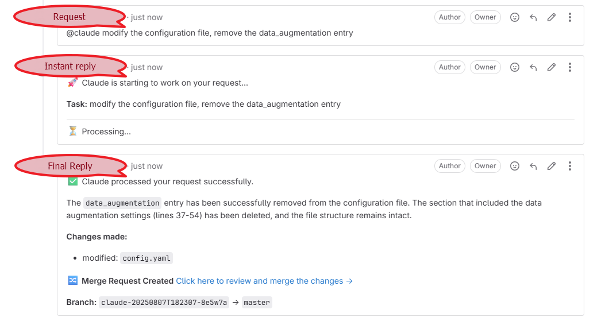

# GitLab Claude Webhook Service 🚀

[](https://deepwiki.com/kylewanginchina/gitlab-claude-webhook)
[![zread](https://img.shields.io/badge/Ask_Zread-_.svg?style=flat&color=00b0aa&labelColor=000000&logo=data%3Aimage%2Fsvg%2Bxml%3Bbase64%2CPHN2ZyB3aWR0aD0iMTYiIGhlaWdodD0iMTYiIHZpZXdCb3g9IjAgMCAxNiAxNiIgZmlsbD0ibm9uZSIgeG1sbnM9Imh0dHA6Ly93d3cudzMub3JnLzIwMDAvc3ZnIj4KPHBhdGggZD0iTTQuOTYxNTYgMS42MDAxSDIuMjQxNTZDMS44ODgxIDEuNjAwMSAxLjYwMTU2IDEuODg2NjQgMS42MDE1NiAyLjI0MDFWNC45NjAxQzEuNjAxNTYgNS4zMTM1NiAxLjg4ODEgNS42MDAxIDIuMjQxNTYgNS42MDAxSDQuOTYxNTZDNS4zMTUwMiA1LjYwMDEgNS42MDE1NiA1LjMxMzU2IDUuNjAxNTYgNC45NjAxVjIuMjQwMUM1LjYwMTU2IDEuODg2NjQgNS4zMTUwMiAxLjYwMDEgNC45NjE1NiAxLjYwMDFaIiBmaWxsPSIjZmZmIi8%2BCjxwYXRoIGQ9Ik00Ljk2MTU2IDEwLjM5OTlIMi4yNDE1NkMxLjg4ODEgMTAuMzk5OSAxLjYwMTU2IDEwLjY4NjQgMS42MDE1NiAxMS4wMzk5VjEzLjc1OTlDMS42MDE1NiAxNC4xMTM0IDEuODg4MSAxNC4zOTk5IDIuMjQxNTYgMTQuMzk5OUg0Ljk2MTU2QzUuMzE1MDIgMTQuMzk5OSA1LjYwMTU2IDE0LjExMzQgNS42MDE1NiAxMy43NTk5VjExLjAzOTlDNS42MDE1NiAxMC42ODY0IDUuMzE1MDIgMTAuMzk5OSA0Ljk2MTU2IDEwLjM5OTlaIiBmaWxsPSIjZmZmIi8%2BCjxwYXRoIGQ9Ik0xMy43NTg0IDEuNjAwMUgxMS4wMzg0QzEwLjY4NSAxLjYwMDEgMTAuMzk4NCAxLjg4NjY0IDEwLjM5ODQgMi4yNDAxVjQuOTYwMUMxMC4zOTg0IDUuMzEzNTYgMTAuNjg1IDUuNjAwMSAxMS4wMzg0IDUuNjAwMUgxMy43NTg0QzE0LjExMTkgNS42MDAxIDE0LjM5ODQgNS4zMTM1NiAxNC4zOTg0IDQuOTYwMVYyLjI0MDFDMTQuMzk4NCAxLjg4NjY0IDE0LjExMTkgMS42MDAxIDEzLjc1ODQgMS42MDAxWiIgZmlsbD0iI2ZmZiIvPgo8cGF0aCBkPSJNNCAxMkwxMiA0TDQgMTJaIiBmaWxsPSIjZmZmIi8%2BCjxwYXRoIGQ9Ik00IDEyTDEyIDQiIHN0cm9rZT0iI2ZmZiIgc3Ryb2tlLXdpZHRoPSIxLjUiIHN0cm9rZS1saW5lY2FwPSJyb3VuZCIvPgo8L3N2Zz4K&logoColor=ffffff)](https://zread.ai/kylewanginchina/gitlab-claude-webhook)
[](https://github.com/kylewanginchina/gitlab-claude-webhook/actions/workflows/ci.yml)
[](https://www.typescriptlang.org/)
[](https://opensource.org/licenses/MIT)

A robust webhook service that integrates GitLab with AI-powered code assistants (Claude Code CLI and OpenAI Codex), enabling AI-powered code assistance directly from GitLab issues, merge requests, and comments.

## ✨ Features

- **GitLab Integration**: Receives webhook events from GitLab for issues, merge requests, and comments
- **Multi-Provider AI Processing**: Supports both Claude Code (`@claude`) and OpenAI Codex (`@codex`) with automatic provider detection
- **Model Selection**: Optionally specify models with `@claude[model=xxx]` or `@codex[model=xxx]` syntax
- **Secure Webhook Verification**: Validates webhook signatures to ensure security
- **Branch-aware Processing**: Automatically creates new branches for AI changes with merge request workflow
- **Automatic Code Changes**: Commits and pushes changes made by AI back to the repository
- **Smart Merge Requests**: Creates professional MRs with conventional commit titles and structured descriptions
- **Real-time Feedback**: Posts results and errors as comments back to GitLab

## Quick Start

### Prerequisites

- Node.js 18+ or Docker
- [Claude Code](https://github.com/anthropics/claude-code) installed (if using Claude provider)
- [OpenAI Codex](https://github.com/openai/codex) installed (if using Codex provider)
- GitLab project with webhook access
- Anthropic API key (for Claude) and/or OpenAI API key (for Codex)
- GitLab API token

### Installation

1. Clone the repository:

```bash
git clone <repository-url>
cd gitlab-claude-webhook
```

2. Copy environment configuration:

```bash
cp .env.example .env
```

3. Configure environment variables in `.env`:

```bash
# Claude API Configuration
ANTHROPIC_BASE_URL=https://api.anthropic.com
ANTHROPIC_AUTH_TOKEN=sk-your-anthropic-token

# OpenAI/Codex API Configuration (optional, for Codex provider)
OPENAI_BASE_URL=https://api.openai.com/v1
OPENAI_API_KEY=sk-proj-your-openai-key

# AI Provider Configuration (optional, all have defaults)
AI_DEFAULT_PROVIDER=claude
CLAUDE_DEFAULT_MODEL=claude-sonnet-4-5-20250929
CODEX_DEFAULT_MODEL=gpt-5.1-codex-max
CODEX_REASONING_EFFORT=high

# GitLab Configuration
GITLAB_BASE_URL=https://gitlab.com
GITLAB_TOKEN=glpat-your-gitlab-token

# Webhook Configuration
WEBHOOK_SECRET=your-webhook-secret
PORT=3000

# Working Directory
WORK_DIR=/tmp/gitlab-claude-work

# Logging
LOG_LEVEL=info
```

### Running with Docker (Recommended)

```bash
# Build and run with Docker Compose
docker-compose up -d

# View logs
docker-compose logs -f
```

### Running Locally

```bash
# Install dependencies
npm install

# Build the project
npm run build

# Start the service
# Note: must run with non-root privilege, due to the requirement for Claude Code's parameter --dangerously-skip-permissions
npm start

# For development with hot reload
# Note: must run with non-root privilege, due to the requirement for Claude Code's parameter --dangerously-skip-permissions
npm run dev
```

## GitLab Configuration

For detailed GitLab setup instructions, including webhook configuration, token permissions, and troubleshooting, see:

📋 **[Complete GitLab Setup Guide](docs/gitlab-setup.md)**

### Quick Setup Summary

1. **Create GitLab Token**: Generate a personal or project access token with `api`, `read_repository`, and `write_repository` scopes
2. **Configure Webhook**: Add webhook to your project with URL `http://your-domain:3000/webhook` and secret token
3. **Set Trigger Events**: Enable Issues events, Merge request events, and Comments
4. **Test Integration**: Create an issue with `@claude` mention to verify setup

## Usage

### In GitLab Issues

Create or comment on an issue with:

```
@claude Please help me optimize this function in src/utils/helper.js
```

Or use Codex:

```
@codex Please help me optimize this function in src/utils/helper.js
```

### In Merge Requests

Add to MR description or comment:

```
@claude Review the security implications of these changes and suggest improvements
```

### Model Selection

Specify a specific model:

```
@claude[model=claude-sonnet-4-5-20250929] Fix the TypeScript errors in the authentication module
```

```
@codex[model=gpt-5.1-codex-max] Refactor this function for better performance
```

### Advanced Usage

You can provide specific instructions:

```
@claude
- Fix the TypeScript errors in the authentication module
- Add proper error handling
- Update the unit tests accordingly
```

## How It Works

1. **Webhook Reception**: Service receives GitLab webhook events
2. **Signature Verification**: Validates webhook authenticity using secret
3. **Content Analysis**: Scans for `@claude` mentions in issues/MRs/comments
4. **Project Preparation**: Clones the GitLab project to a temporary directory
5. **Branch Management**: Creates timestamp-based branch for Claude changes
6. **Claude Execution**: Runs Claude Code CLI with the extracted instructions
7. **Change Handling**: Commits and pushes any code changes made by Claude
8. **Smart MR Creation**: Automatically creates merge requests with conventional commit format
9. **Feedback**: Posts results or errors as comments back to GitLab

## Integration Example

Here's what the GitLab integration looks like in action when you use `@claude` mentions:



The screenshot shows the complete workflow:

1. **Request**: User creates an issue or comment with `@claude` mention and specific instructions
2. **Instant Reply**: Service immediately acknowledges the request and starts processing
3. **Final Reply**: Claude processes the request, makes the necessary changes, and creates a merge request with detailed information about what was modified

The service automatically:

- Creates a timestamped branch for the changes
- Executes the Claude Code CLI with the provided instructions
- Commits and pushes any code modifications
- Generates a professional merge request with conventional commit format
- Provides a direct link to review and merge the changes

## API Endpoints

- `GET /` - Service information
- `GET /health` - Health check endpoint
- `POST /webhook` - GitLab webhook receiver

## Configuration

For detailed configuration instructions including environment variable expansion, Docker setup, and troubleshooting, see:

📋 **[Environment Configuration Guide](docs/CONFIG.md)**

### Environment Variables

**Core Required:**

| Variable         | Description               |
|------------------|---------------------------|
| `GITLAB_TOKEN`   | GitLab API token          |
| `WEBHOOK_SECRET` | Webhook validation secret |

**AI Provider Required (based on usage):**

| Variable               | Description                      |
|------------------------|----------------------------------|
| `ANTHROPIC_AUTH_TOKEN` | Required when using Claude       |
| `OPENAI_API_KEY`       | Required when using Codex        |

**Optional (all have defaults):**

| Variable               | Description                    | Default                          |
| ---------------------- | ------------------------------ | -------------------------------- |
| `AI_DEFAULT_PROVIDER`  | Default AI provider            | `claude`                         |
| `ANTHROPIC_BASE_URL`   | Anthropic API base URL         | `https://api.anthropic.com`      |
| `OPENAI_BASE_URL`      | OpenAI API base URL            | `https://api.openai.com/v1`      |
| `CLAUDE_DEFAULT_MODEL` | Default model for Claude       | `claude-sonnet-4-5-20250929`     |
| `CODEX_DEFAULT_MODEL`  | Default model for Codex        | `gpt-5.1-codex-max`              |
| `CODEX_REASONING_EFFORT` | Codex reasoning level        | `high`                           |
| `GITLAB_BASE_URL`      | GitLab instance URL            | `https://gitlab.com`             |
| `PORT`                 | Server port                    | `3000`                           |
| `WORK_DIR`             | Temporary work directory       | `/tmp/gitlab-claude-work`        |
| `LOG_LEVEL`            | Logging level                  | `info`                           |

### Codex Custom Provider Configuration

Codex configuration is **automatically generated** from environment variables at container startup. No manual `config.toml` file is needed.

**Environment variables for Codex config:**

| Variable | Description | Default |
|----------|-------------|---------|
| `OPENAI_BASE_URL` | API endpoint URL | `https://api.openai.com/v1` |
| `OPENAI_API_KEY` | API key | Required for Codex |
| `CODEX_DEFAULT_MODEL` | Model name | `gpt-5.1-codex-max` |
| `CODEX_REASONING_EFFORT` | Reasoning level | `high` |

Provider name is auto-extracted from `OPENAI_BASE_URL` (e.g., `https://88code.org/...` → `88code`).

**Example for custom endpoint (e.g., 88code.org):**

```bash
OPENAI_BASE_URL=https://88code.org/openai/v1
OPENAI_API_KEY=your-api-key
CODEX_DEFAULT_MODEL=gpt-5.1-codex-max
CODEX_REASONING_EFFORT=high
```

The container entrypoint script automatically generates `~/.codex/config.toml` with:
- Custom model provider configuration
- Base URL and API key settings
- Reasoning effort and model selection

### GitLab Token Permissions

Your GitLab token needs the following scopes:

- `api` - Full API access
- `read_user` - Read user information
- `read_repository` - Read repository
- `write_repository` - Write to repository

## Security Considerations

- Always use webhook secrets for signature verification
- Limit GitLab token permissions to minimum required
- Run the service in a secure environment
- Monitor logs for suspicious activity
- Consider network restrictions and firewall rules

## Troubleshooting

### Common Issues

1. **"Claude Code CLI not found"**
   - Ensure Claude Code CLI is installed and in PATH
   - For Docker: Claude Code CLI needs to be available in the container

2. **"Invalid webhook signature"**
   - Verify `WEBHOOK_SECRET` matches GitLab webhook configuration
   - Check that GitLab is sending the correct header

3. **"Failed to clone project"**
   - Verify GitLab token has repository access
   - Check network connectivity to GitLab
   - Ensure branch exists

4. **"Permission denied"**
   - Verify GitLab token has write permissions
   - Check repository settings and branch protection rules

### Logs

View detailed logs:

```bash
# Docker
docker-compose logs -f gitlab-claude-webhook

# Local
tail -f combined.log
```

## Development

### Building

```bash
npm run build
```

### Linting

```bash
npm run lint
```

### Project Structure

```
src/
├── __tests__/                   # Test files
│   ├── setup.ts                 # Jest test setup
│   └── webhook.test.ts          # Webhook functionality tests
├── index.ts                     # Main entry point with environment loading
├── server/
│   └── webhookServer.ts         # Express server and webhook handling
├── services/
│   ├── eventProcessor.ts        # GitLab event processing logic
│   ├── projectManager.ts        # Git operations and project management
│   ├── claudeExecutor.ts        # Basic Claude Code CLI execution
│   ├── streamingClaudeExecutor.ts # Streaming Claude execution with real-time updates
│   ├── codexExecutor.ts         # OpenAI Codex CLI execution with streaming
│   └── gitlabService.ts         # GitLab API interactions
├── types/
│   ├── gitlab.ts                # GitLab-related type definitions
│   └── common.ts                # Common type definitions
└── utils/
    ├── config.ts                # Configuration management with variable expansion
    ├── configDebug.ts           # Configuration debugging utilities
    ├── codexConfig.ts           # Auto-generate Codex config.toml at startup
    ├── logger.ts                # Winston-based logging utility
    ├── webhook.ts               # Webhook utilities and signature verification
    └── mrGenerator.ts           # Smart merge request generation
```

## Documentation

- 📋 [GitLab Configuration Guide](docs/gitlab-setup.md) - Complete setup instructions for GitLab integration
- ⚙️ [Environment Configuration Guide](docs/CONFIG.md) - Detailed configuration instructions with variable expansion and Docker setup
- 🔧 [API Reference](#api-endpoints) - Available endpoints and usage
- 🏗️ [Project Structure](#project-structure) - Codebase organization
- 🐛 [Troubleshooting](#troubleshooting) - Common issues and solutions

## Contributing

1. Fork the repository
2. Create a feature branch
3. Make your changes
4. Add tests if applicable
5. Submit a pull request

## License

MIT License - see LICENSE file for details
